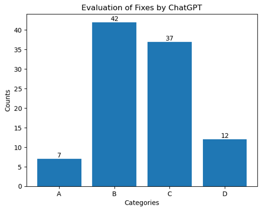

# Automated Resolution of ML issues using ChatGPT

## A. Method
### Dataset
The dataset contains 140 GitHub issues relating to machine learning (ML) code. Each entry includes the project's name, the URL of the corresponding issue, the issue number, and the associated pull request (PR) responsible for resolving the issue.
### Obtain Human's Solution
In order to obtain a human-generated solution for issue resolution, which I could subsequently compare with ChatGPT's performance, I examined the commit that the repository owner had merged into the main branch. This commit's verification ensured its accuracy. Subsequently, I extracted the differences between this specific commit and the previous one. This approach enabled me to precisely identify the altered lines of code and the files in which these changes were made.\
\
At this point, I had compiled a list of all the files that had undergone changes, along with the solution provided by a human.
### Prompt
For ChatGPT, I used **ChatGPT4 API** to ensure the latest technology and the highest token limit possible. For the prompt that goes into ChatGPT, each contains:
* **Issue's content**
* **List of the files that need to be fixed**
* **Each code file content**
* **Return the solution in diff format**\
Due to the relatively short duration of the internship, I opted to streamline the process by exclusively supplying ChatGPT with the specific code files requiring modification. This approach aimed to save time by bypassing the need for ChatGPT to analyze every single code file within the repository.\

## B. Evaluation Metrics
To evaluate how well ChatGPT performed in resolving these issues, I divided it into 2 categories: performance and similarity to human answers.
### Performance
* **Completeness**: 1-5
* **Accuracy:** 1-5
* **Clarity of Explanation**: 1-5
### Comparison with Human's answer

## C. Results

## D. Conclusion
* ChatGPT shows potential in fixing ML code
* May lack the contextual understanding of human experts who possess deep expertise and domain knowledge, enabling them to understand the nuances and intricacies of machine learning code
* Valuable as a complementary tool to support human experts
* Can assist in generating initial solutions, providing alternative approaches, or offering insights\
→ _Human involvement remains essential to provide expertise, domain knowledge, and critical thinking in complex scenarios._
